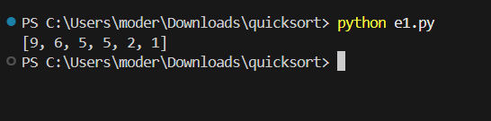
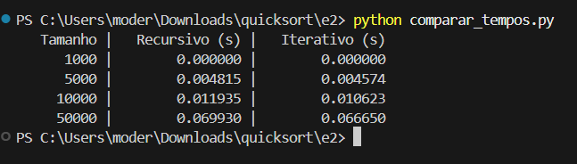
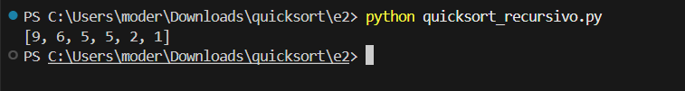
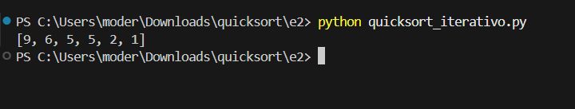

# Atividade - QuickSort

Repositório contendo a resolução da Atividade sobre o algoritmo QuickSort, com implementações e análises.

---

## Estrutura

- `e1.py`: Implementação do QuickSort recursivo para ordenação decrescente.
- `e2/`
  - `quicksort_recursivo.py`: QuickSort recursivo (decrescente).
  - `quicksort_iterativo.py`: QuickSort iterativo (decrescente).
  - `comparar_tempos.py`: Comparação de tempo entre as versões recursiva e iterativa.
- `e3.py`: Análise e correção de erro lógico na implementação do QuickSort.
- `e4.py`: Crítica e correção da função `sep` de particionamento.
- `e5.py`: Análise da sequência de chamadas recursivas do QuickSort.
- `img/`: Pasta contendo capturas de tela da execução dos programas.

---

## Questão 1

**QuickSort Recursivo Decrescente**

Código que ordena um vetor em ordem decrescente utilizando a técnica de QuickSort de forma recursiva.

**Resultado de execução:**



---

## Questão 2

**Comparação entre QuickSort Recursivo e Iterativo**

Foram realizados testes de desempenho com vetores de tamanhos variados:

| Tamanho  | Recursivo (s) | Iterativo (s) |
|:--------:|:-------------:|:------------:|
| 1000     | 0.000000      | 0.000000     |
| 5000     | 0.004815      | 0.004574     |
| 10000    | 0.011935      | 0.010623     |
| 50000    | 0.069930      | 0.066650     |

**Captura da execução:**



**Execução Recursivo:**



**Execução Iterativo:**



### Discussão

- A versão recursiva possui um código mais simples e intuitivo.
- A versão iterativa evita problemas de stack overflow em grandes vetores.
- Ambas apresentam desempenho semelhante, com pequena vantagem para a iterativa.

---

## Questão 3

**Análise do Código Dado**

Código dado:

```python
def qsrt(array, left, right):
    j = partition(array, left, right)
    if left < j - 1:
        qsrt(array, left, j - 1)
    if j + 1 < right:
        qsrt(array, j + 1, right)
```

### Problemas
- As condições `left < j - 1` e `j + 1 < right` podem pular vetores com 1 ou 2 elementos.
- Isso compromete a ordenação final.

### Correção

```python
def qsrt_correta(array, left, right):
    if left < right:
        j = partition(array, left, right)
        qsrt_correta(array, left, j - 1)
        qsrt_correta(array, j + 1, right)
```

---

## Questão 4

**Crítica à função de separação `sep`**

Código dado:

```python
def sep(array, left, right):
    j = right
    for i in range(right - 1, left - 1, -1):
        if array[i] > array[right]:
            array[i], array[right] = array[right], array[i]
            j = i
    return j
```

### Problemas
- O pivô é trocado de posição várias vezes de forma incorreta.
- Não garante a divisão correta dos elementos menores e maiores que o pivô.

### Correção sugerida

```python
def partition(array, left, right):
    pivo = array[right]
    i = left - 1
    for j in range(left, right):
        if array[j] <= pivo:
            i += 1
            array[i], array[j] = array[j], array[i]
    array[i + 1], array[right] = array[right], array[i + 1]
    return i + 1
```

---

## Questão 5

**Sequência de Chamadas**

Para o vetor `[55, 44, 22, 11, 66, 33]`, a sequência de chamadas seria:

```
quicksort(array, 1, 6)
    quicksort(array, 1, 4)
        quicksort(array, 1, 0)
        quicksort(array, 2, 4)
            quicksort(array, 2, 2)
            quicksort(array, 4, 4)
    quicksort(array, 6, 6)
```

## Autor

Gabriel Henrique Moreira de Souza
